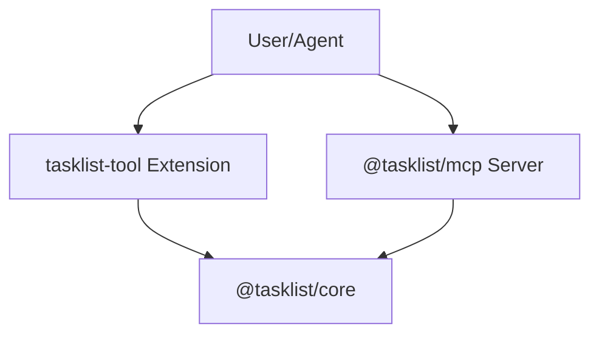

# Tasklist Tool

A suite of tools designed for structured task and artifact management, perfectly optimized for use by AI agents. This repository contains both a **VS Code extension** and a **Model Context Protocol (MCP) Server**, sharing the same underlying robust logic.

## Overview

The Tasklist Tool provides a framework for tracking development progress and maintaining structured documentation (artifacts) alongside code. By exposing Language Model Tools, AI agents can interactively manage tasks, state, and generate documentation using standard templates without requiring manual developer involvement.

### Repository Structure



This project is structured as a **monorepo** consisting of three npm packages:

- [**@tasklist/core**](./packages/core/README.md): Shared business logic, task models, and Markdown template engine.
- [**tasklist-tool**](./packages/extension/README.md): The VS Code extension wrapper.
- [**@tasklist/mcp**](./packages/mcp/README.md): The standalone Model Context Protocol server.

## Key Features

- **Hierarchical Task Management**: Organize work into **Projects** and **Subtasks**. Projects act as containers that can hold multiple subtasks, allowing for better organization of complex workflows.
- **Structured Task Management**: Create, start, and close tasks with unique tracking identifiers.
- **Active Task Context**: Set an "active" task to simplify subsequent operations and focus an agent's workflow.
- **Artifact Management**: Generate and update documentation artifacts (e.g., implementation plans, research notes, walkthroughs).
- **Template System**: Use YAML-based templates to ensure consistently structured documentation generation.
- **Custom Artifact Types**: Register new artifact types at the workspace level for unique domains.

## Available Agent Tools

Both the VS Code Extension and the MCP Server expose the exact same **12 core tools** for comprehensive task and artifact management.

### Task Lifecycle Tools

#### `list_tasks`
Lists tasks in the workspace, optionally filtered by status or project.
- `status` (enum, optional): `open`, `in-progress`, or `closed`.
- `parentTaskId` (string, optional): Filter tasks by parent project ID. If omitted, only top-level tasks/projects are returned.

#### `create_task`
Initialize a new task or project.
- `taskId` (string, required): Unique identifier (e.g., `feature-login`).
- `type` (enum, optional): `task` or `project`. Defaults to `task`.
- `parentTaskId` (string, optional): ID of the parent project.

#### `activate_task`
Sets a task as the currently active task.
- `taskId` (string, required): The ID of the task to activate.
- `parentTaskId` (string, optional): The ID of the parent project. **Required for subtasks.**
- `activateProject` (boolean, optional): If `true`, also sets the parent project as the active task. Defaults to `true`.

#### `deactivate_task`
Clears the currently active task. (No parameters)

#### `start_task`
Transitions a task from `open` to `in-progress`.
- `taskId` (string, required): The ID of the task to start.
- `parentTaskId` (string, optional): The ID of the parent project. **Required for subtasks.**

#### `close_task`
Transitions a task from `in-progress` to `closed`.
- `taskId` (string, required): The ID of the task to close.
- `parentTaskId` (string, optional): The ID of the parent project. **Required for subtasks.**

#### `promote_to_project`
Converts an existing task into a project, enabling it to contain subtasks.
- `taskId` (string, required): ID of the task to promote.

---

### Artifact Management Tools

#### `list_artifact_types`
List all registered artifact types (built-in and custom). (No parameters)

#### `register_artifact_type`
Register a new custom artifact type and template.
- `id` (string, required): Unique ID for the type (e.g., `sprint-retro`).
- `displayName` (string, required): Human-friendly name.
- `description` (string, required): Description of the artifact.
- `templateBody` (string, optional): Markdown template body.

#### `list_artifacts`
Show populated and available artifacts per task.
- `taskId` (string, optional): Defaults to the active task.
- `parentTaskId` (string, optional): Required for subtasks.

#### `get_artifact`
Retrieve documentation structure or content.
- `artifactType` (string, required): The ID of the artifact type.
- `taskId` (string, optional): Defaults to the active task.
- `parentTaskId` (string, optional): Required for subtasks.

#### `update_artifact`
Write finished documentation for a task.
- `artifactType` (string, required): The ID of the artifact type.
- `content` (string, required): Full Markdown body (no frontmatter).
- `taskId` (string, optional): Defaults to the active task.
- `parentTaskId` (string, optional): Required for subtasks.

## Getting Started

### Installation
1. Clone the repository and open it in your terminal.
2. Run `npm install` at the root folder to pull dependencies and link the workspaces.
3. Run `npm run compile` to build the entire monorepo (`core`, `extension`, and `mcp`).

### Using the MCP Server

The standalone Model Context Protocol server operates over `stdio` and allows any MCP-compatible agent Client to manage your tasklist.

To boot the server on a project, set the `TASKLIST_WORKSPACE` environment variable to point to the repository the agent should manage, and run the binary:

```bash
export TASKLIST_WORKSPACE=/path/to/your/project
npx tasklist-mcp
```
*(Alternatively, execute `node packages/mcp/bin/tasklist-mcp` directly).*

### Running the VS Code Extension

1. After `npm install` and `npm run compile`, open the repository in VS Code.
2. Press `F5` to open a new VS Code development window with the extension loaded.

## Development Workflows

| Action                        | Command (from root) |
| ----------------------------- | ------------------- |
| **Compile All**               | `npm run compile`   |
| **Watch (Continuous Build)**  | `npm run watch`     |
| **Lint**                      | `npm run lint`      |
| **Run All Tests**             | `npm run test`      |
| **Package VS Code Extension** | `npm run package`   |

> **Note:** The `npm run package` command compiles the extension via `vsce` internally, and the built `.vsix` wrapper will be produced inside `packages/extension/`.

### GitHub Actions (CI/CD)
The project includes automated pipelines configured in `.github/workflows/`.
Pushes matched to `v*` tags will automatically run `npm run package` on the workspace and publish a GitHub Release with the bundled `.vsix` file attached.

## License

Refer to the project's license file for details.
